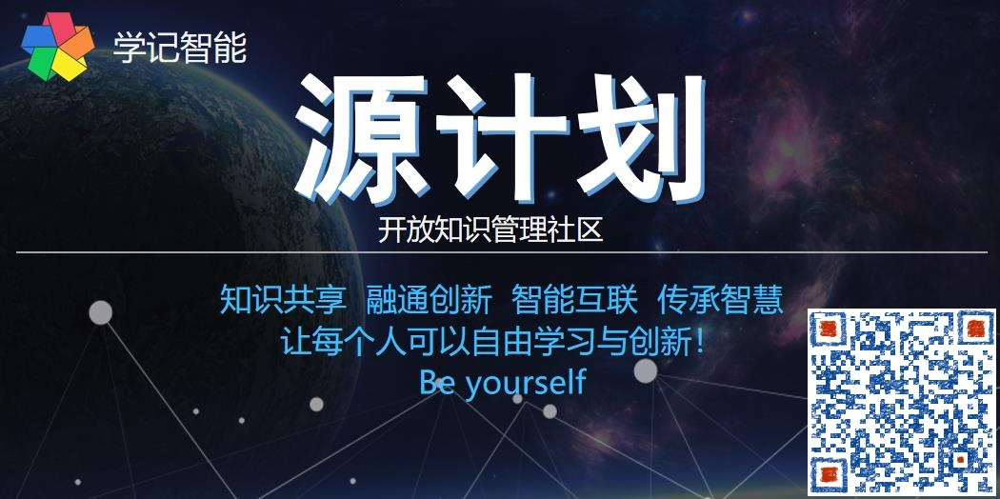
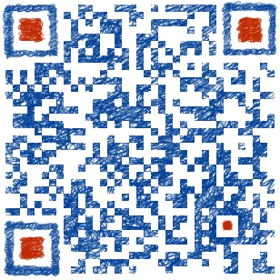

# 第五视界 (The Fifth World-TFW)

与私人助理一起创造和探索新的世界!
Together with your pesonal assistant to create and explore the new world!

- P1 社会企业：**学记智能**，专注智能知识管理，提供专业知识服务！
- P2 开放社区：**学记DAO**，基于区块链构建的 DAO 自治组织。
- P3 工具平台：**学记助理**，智能文档、知识可视化、智能模板、虚拟助手数字人、GTD
- P4 领域语言：**Magic**，DSL、交互、命令、编程
- P5 虚拟空间：知识地图、记忆宫殿、元宇宙
- P6 贡献积分：基于区块链的经济系统、徽章、智点
- P7 知识图谱：基于统一语义的领域知识图谱、百科知识库
- P8 智能硬件：电子纸笔、穿戴、机器人
- P9 线下空间：🍮 Tea AI Coffee

## 诚邀您加入【学记DAO】社区

## 目录

- [我们是 Who](#-我们是-who)
- [为什么 Why](#-为什么-why)
- [怎样做 How](#-怎样做-how)
- [参与贡献](#-参与贡献)
- [工作组](#-工作组分类及研究方向)
- [向贡献者致谢](#-致谢)
- [知识产权](#-知识产权)
- [联系加入](#-联系)

## 👽 我们是 Who?

我们是一个基于共有产品的开放知识管理社区。专注智能知识管理，提供专业知识服务，创建知识之源！致力于在这个信息爆炸的时代，化繁为简降低知识熵，扩展人的能力，促进高效学习与创新，进而促进知识共享、融通创新、智能互联、传承智慧！让每个人可以自由学习与创新，成为自己！Be yourself!

- **价值主张**： 大道至简、以人为本，从知识管理应用切入，以扩展人的能力为目的，开发智能协同工具系统，通过人类计算（众包）+机器学习的方式，人机协作挖掘人类知识金矿，探究知识及智能本质，整合各领域知识及关联，移除知识与协作的鸿沟，协同积累知识与创新。把人从信息爆炸及繁琐重复的劳动中解放出来，从事自己热爱的、更具创造性的劳动！

- **理念**：开放、协作、共赢、创新
- **基本原则**：
  - **热爱胜于金钱**：动机、情感、激励、责任
  - **发挥群体力量**：分享、合作和集体行动
  - **建立网络规则**：承诺、工具和协议
  - **正能量可持续**：信念、持续迭代和积累
- **愿景** 成为全球最大的协同学习与创新社区，共同积累精神财富！

## 🚀 为什么 Why?
 

- **知识就是财富**，积累知识胜过积累金钱，知识是人类进步的阶梯，是个人及企业的核心竞争力
- **化繁为简**，挖掘本质及关联，知其然知其所以然，促进融合创新
- **知识共享**，探索新的知识存储展示分享方式，建立高效沟通协同与积累分享的基础
- **实现以及应对人工智能**，知识与智能相辅相成，知识管理应用以人为本凝聚社区促进技术，形成闭环
- **重新造轮子**，专属助理，极致体验，是为自己创造一个工具，支持高效学习与创新
- **作为事业**，一项值得奋斗十年的事业!
- Do something different, make a change! 

## 🎯 怎样做 How?

**一个最佳组合**：知识管理+助理工具+开源项目+开放社区。基于共同的知识需求，通过[开源项目](#⭐-项目列表)结合产学研，开发智能工具支持社群协同，促进知识协作与共享。通过众包集体智慧完善产品及技术，形成闭环，从知识管理探索实现通用智能。是实现应和对人工智能的最佳途径！

 
KM:知识管理，P=人，+=工具系统，K=知识，S=社群共享

### 1.专注智能知识管理，从信息服务到知识服务，从知识管理到人工智能

### 2.打造社会企业，工作组到开放社区

### 3.极致体验的创新产品，智能文档到第五世界

以人为本，开发扩展人的能力的工具，帮助你不断深入理解和高效管理你的信息、知识及洞见，以创造更多价值。

#### 设计原则

- 极致体验、专属定制、融通、可持续、易用、高性能、可定制
- **至简**，像一张智能的纸；**便捷**快速找到所需  
- 让你**专注**做事；**链接**人与知识；智能推理推荐（**能动性**）   
- 人性定制、实时协作、开放共享、**价值**驱动、去中心化

#### 特性

- **基于统一语义**：化繁为简、融合不同领域学科、人与机器的知识，语义->概念->信息->知识->智能
- **一切皆文档**：基于语义组件、智能模板，组合成你需要的应用
- **多层次可视化**：实时协作、多视图多层次与知识交互（纯文本、表格、导图、图表、日历、项目、VR）
- **对话式智能交互**：目的上下文、适时、实时、必要，对话式、响应式。快速找到所需，降低软件使用成本，智能推荐提醒、辅助推理决策创新。
- **链接知识与人**：把知识链接成网络、加强人与知识的关联、实时协作
- **专属定制**: 可自由定制、组件、插件、命令、自然交互、学习增强
- **价值驱动**：目标管理、任务化、游戏化、贡献积分激励、共享经济

## 🍀 组织架构：敏捷协作的网络化工作组

将社区视为一个灵活的自组织网络，结构基于职能和项目，聚焦产品、通过共同信念合作、知识共享激发能量，共同制定完善规则，基于系统平台按项目**自由分工协作**，按贡献分配激励，发挥集体智慧、维护共同利益。

- **组成**：社会企业、开放社群、工作组、贡献者
- **内外部互相协作的**：1 组长 + 5 核心成员 + 贡献者

## 🤝 加入社区

- **加入**：根据[社区章程][2]中的流程加入，产生成员代号: A001（A-Z + 3 位十六进制）
- **初期奖励规则**：前 100 名送 3000 智点，获得工具的终身免费高级会员
- **职责**：宣传践行组织理念、积极参与贡献，维护组织共同利益
- **权益**：股份+积分+智点+代币, 参与修订规则、发布需求、共享知识及资源、按贡献积分规则获得**智点**、**徽章**、**分红**

## 👊 参与贡献

这是一项长期而艰巨的事业，我们希望团结一切可以团结的力量，努力使任何人及组织都可参与贡献，欢迎各类认同社区价值的学习者、创新者加入贡献力量，一起实现梦想、共创未来！💪

- 选择工作组→选择项目→选择角色→明确职责→开始贡献
- 可以是社区运营、设计开发、分享知识、提供各类资源、提交或投票新功能特性需求等
- 在社区协同平台中集成工作组、路线图、项目任务、积分规则、积分、社区文档等
- 欢迎提出各种意见建议，提交[pull requests](https://github.com/xuejiai/community/pulls) 及 [issue](https://github.com/xuejiai/community/issues)。
- 【💰 捐赠】如果您认同我们请支持我们快速持续发展。

**加入申请** 👉 [http://xuejiai-org.mikecrm.com/Z5BuYsE](http://xuejiai-org.mikecrm.com/Z5BuYsE)
---

### 📡 工作组分类及研究方向

- 企业组：企业建设、商业化，ToC 知识服务（工具型）、ToB 数字孪生（无代码）、档案管理
- 理论组：理论研究、智能伦理、语义模型、知识框架、认知科学、复杂系统
- 产品组：需求管理、产品设计、产品运营
- 算法组：语义计算、自然语言理解、知识图谱、深度学习、集群智能、区块链、机器视觉等
- 开发组：软硬件设计开发、实现、部署、测试
- 业务组：智能知识管理（业务建模、解决方案、最佳实践、培训咨询）、行业研究、业务合作
- 社群组：社区管理、活动策划、社群经济、项目众包
- 内容组：新媒体、前沿资讯、发布宣传项目、社区进展、方最佳实践整理、专家知识创作分享
- 用户组：深度使用产品、提供需求建议、协作分享知识、宣传产品

## 💜 致谢

感谢所有促进社区发展的贡献者!

## 相关文档

| | | | |
|:---:|:---:|:---:|:---:|
| [**社区共识**][1] | [**社区章程**][2]   | [**贡献指南**][3] | [**贡献者协议**][4]|
| [**积分规则**][5] | [**贡献者列表**][6] | [**运营手册**][7] | **其他**|

## 📄 知识产权

文档内容：CC-BY-SA [知识共享许可协议](http://creativecommons.org/licenses/by-sa/3.0/cn)  
项目源码：许可协议 [MIT](./LICENSE)

## 📞 联系

微信群：这里汇集了不同专业领域的人才，展开各种形式的交流合作，发现新思想、新理念，协同积累分享知识，合作学习与创新，互助让想法与梦想成为现实。

入群交流，请添加微信：  
 

😺 **期待与您合作！**
---

---

> - *幸福在于知足常乐、适可而止、懂得珍惜、记得感恩，从心而为成为自己！*

 本作品采用<a rel="license" href="http://creativecommons.org/licenses/by-sa/3.0/cn/">知识共享署名-相同方式共享 3.0 中国大陆许可协议</a>进行许可。

[1]: ./001-社区共识.md
[2]: ./002-社区章程.md
[3]: ./003-贡献指南.md
[4]: ./004-贡献者协议.md
[5]: ./005-积分规则.md
[6]: ./006-贡献者列表.md
[7]: ./007-运营手册.md
